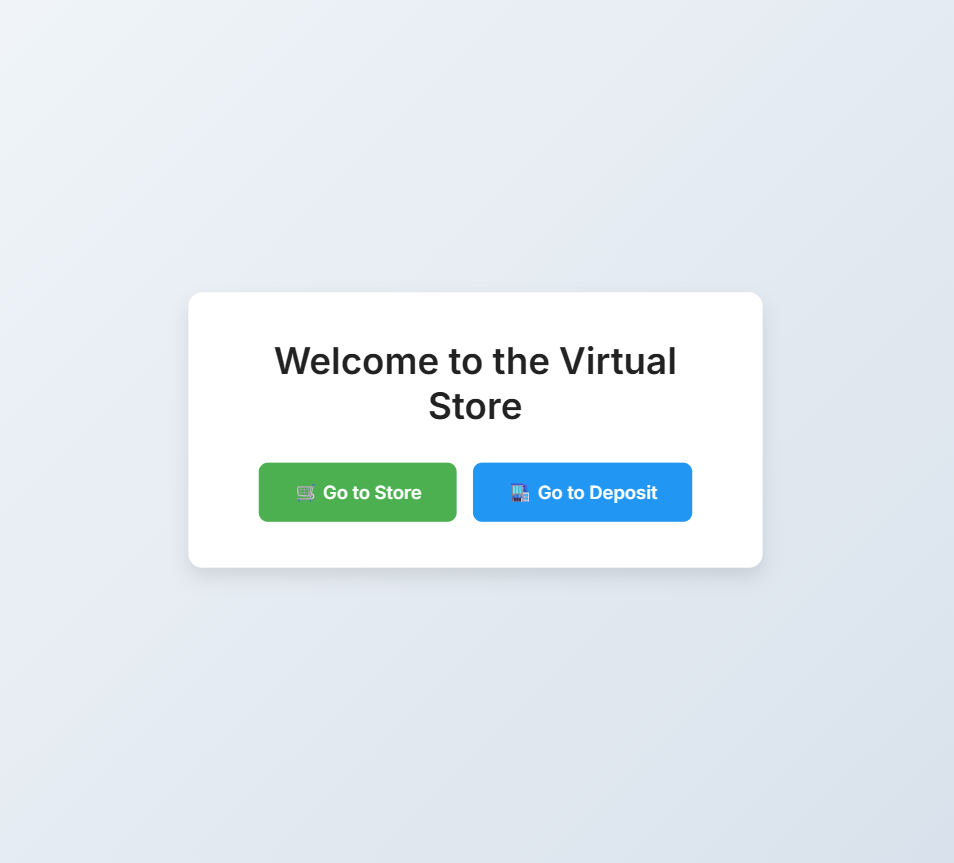
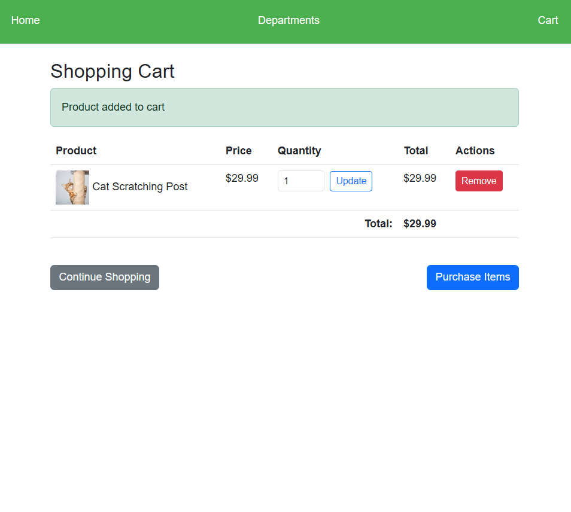
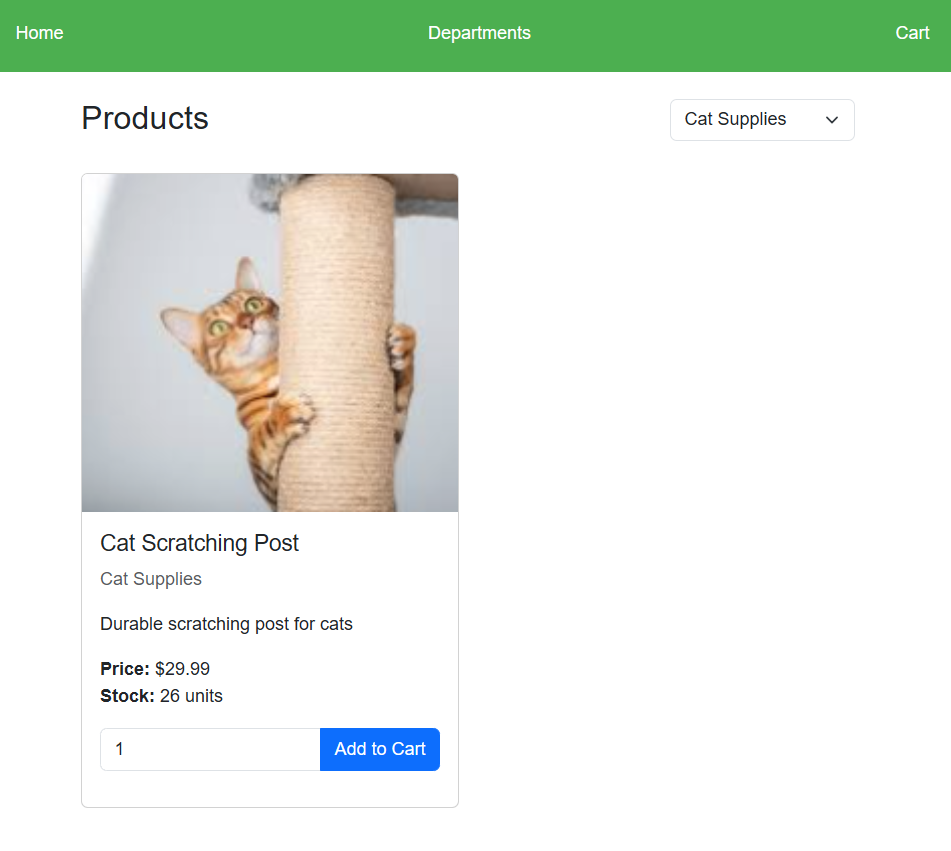
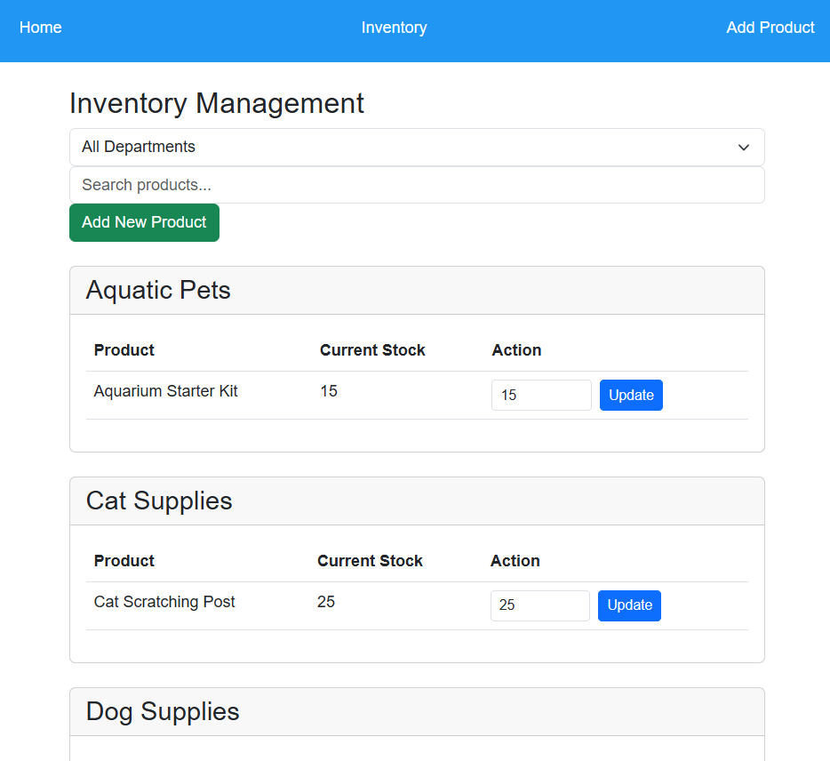

# Virtual Store & PL/SQL Database Management

[](https://www.php.net/)
[](https://www.oracle.com/database/)
[](LICENSE)

A full-stack e-commerce web application designed for pet supplies and accessories. Developed as a practical integration of **PHP** with **Oracle PL/SQL**, this project demonstrates database-level business logic (triggers, stored procedures, functions, and sequences) integrated with an interactive web storefront.

---

## Key Features

- **Department & Category Browsing**: Dynamic product navigation filtered by pet category.
- **Persistent Shopping Cart**: Real-time cart calculations, quantity adjustment, and item removal.
- **Purchase Simulation & Transaction Safety**: Transactional checkout with PL/SQL rollback mechanisms on errors.
- **Database-Enforced Integrity**:
  - **Triggers**: Automated constraint validation (preventing negative inventory stock).
  - **Stored Procedures**: Thread-safe stock updates with `SELECT FOR UPDATE` row locks (`process_purchase`).
  - **PL/SQL Functions**: Optimized cart totals calculation (`calculate_cart_total`).
- **One-Click Database Reset**: Built-in scripts (`reset_db.php`, `setup.sql`) for rapid environment seeding.

---

## Tech Stack & Architecture

- **Frontend**: HTML5, CSS3, JavaScript (Responsive UI components & navigation)
- **Backend**: PHP (Session handling, routing, database abstraction)
- **Database**: Oracle Database / MariaDB / MySQL compatible schema with **PL/SQL** procedural extensions
- **Server**: Apache / Nginx / XAMPP

### Database Schema

#### Departments (`departments`)
| Column | Type | Constraints | Description |
|:---|:---|:---|:---|
| `id` | `NUMBER` | `PRIMARY KEY` | Unique department ID |
| `name` | `VARCHAR2(100)` | `NOT NULL` | Department / category name |

#### Products (`products`)
| Column | Type | Constraints | Description |
|:---|:---|:---|:---|
| `id` | `NUMBER` | `PRIMARY KEY` | Unique product identifier |
| `name` | `VARCHAR2(100)` | `NOT NULL` | Product name |
| `price` | `NUMBER(10,2)` | `NOT NULL` | Item price |
| `description` | `VARCHAR2(1000)` | `NULL` | Product details and description |
| `image_path` | `VARCHAR2(255)` | `NULL` | Relative image asset path |
| `department_id` | `NUMBER` | `FOREIGN KEY` | References `departments(id)` |
| `stock` | `NUMBER` | `DEFAULT 0` | Available stock count |

#### Cart (`cart`)
| Column | Type | Constraints | Description |
|:---|:---|:---|:---|
| `id` | `NUMBER` | `PRIMARY KEY` | Cart item ID (from `cart_seq`) |
| `user_id` | `NUMBER` | `NULL` | User session identifier |
| `product_id` | `NUMBER` | `FOREIGN KEY` | References `products(id)` |
| `quantity` | `NUMBER` | `NOT NULL` | Selected purchase quantity |

---

## Project Structure

```text
├── cart/                    # Shopping cart operations (add, remove, checkout)
├── components/              # Modular UI components (header, footer, navbars)
├── config/                  # Database connection credentials & PDO/OCI setup
├── departments/             # Department-specific product catalog views
├── images/                  # Static product assets and UI icons
├── products/                # Product management and inventory logic
├── screenshots/             # Visual demonstration previews
├── index.php                # Main landing page & product showcase
├── reset_db.php             # Database reset & re-seeding utility
├── setup.sql                # Complete PL/SQL schema, triggers, and sample data
└── test_db.php              # Connection diagnostic script
```

---

## Installation & Setup

### 1. Prerequisites
- **Web Server**: XAMPP, WampServer, or native Apache/Nginx
- **PHP**: Version 7.4 or 8.x (ensure `oci8` or `pdo_mysql` extensions are enabled)
- **Database**: Oracle XE / Oracle Cloud Autonomous DB / MySQL

### 2. Database Configuration
1. Open your database management tool (e.g., SQL Developer, phpMyAdmin).
2. Execute the `setup.sql` script to create tables, sequences, triggers, and seed sample products.
3. Configure your credentials in `config/database.php`:
   ```php
   <?php
   $host = 'localhost';
   $db   = 'virtual_store';
   $user = 'your_username';
   $pass = 'your_password';
   ```

### 3. Running Locally
1. Clone or copy the repository into your web server's public directory:
   ```bash
   # For XAMPP on Windows
   git clone https://github.com/GalanRaduM24/animal_store_site.git C:/xampp/htdocs/animal_store_site
   ```
2. Start the Apache and Database services.
3. Open your browser and navigate to:
   ```url
   http://localhost/animal_store_site/
   ```

---

## Screenshots

| Home Catalog | Shopping Cart |
|:---:|:---:|
|  |  |

| Product View | Inventory Management |
|:---:|:---:|
|  |  |

---

## Academic Context

This application was developed as a university coursework project focusing on advanced database design and the integration of procedural database logic (**PL/SQL**) with modern web architectures.
